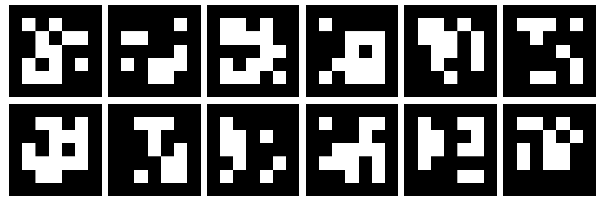

# MVPS Studio

<p align="justify"> Multiview photometric stereo (MVPS) studio hardware and software to build a small object scanner </p>


\* images are generated by DALL-E 3

<p align="justify"> Multiview stereo uses images taken from multiple angles to reconstruct the geometry of the scene/object. Photometric stereo extracts the surface normals using the information provided by the changing illumination conditions. We combine information provided by these two image acquisition methods to generate accurate 3D shape reconstruction. </p>

# Hardware
[](https://www.digitec.ch/de/s1/product/lenovo-legion-pro-7-rtx-4090-16-intel-core-i9-13900hx-32-gb-2000-gb-ch-notebook-36343276)
[](https://www.digitec.ch/en/s1/product/raspberry-pi-new-raspberry-pi-5-8gb-development-boards-kits-38955607)
[](https://www.mouser.ch/ProductDetail/Intel/82635DSD405?qs=Znm5pLBrcAKRij2Y1eB7yg%3D%3D)
[](https://www.bastelgarage.ch/dfrobot-neopixel-ring-24x-ws2812-rgb-led)

### Linux Computer with GPU
___

<p align="justify"> A laptop with NVIDIA GeForce RTX 4090 GPU that runs Ubuntu 22.04 is used to perform data acquisition, storage, 3D geometry reconstruction and analysis. After setting up Ubuntu 22.04 operating system on the laptop, please follow the instructions below for Raspberry Pi setup and MVPS Studio software installation (including CUDA and cuDNN setup). </p>

### Raspberry Pi
___

<p align="justify"> Raspberry Pi 5 with 8GB RAM is used to control LED ring arrays. LED ring array should be connected to GPIO 10 (pin number 19) on Raspberry Pi. After connections are established, Raspberry Pi can be used to trigger light illumination with different patterns. </p>

### Raspberry Pi Setup

1 - Please follow the official Raspberry Pi dcoumentation for operating system setup: [OS Setup](https://www.raspberrypi.com/documentation/computers/getting-started.html)

<p align="justify"> It is important to name the Raspberry Pi as "light" and user name as "person" with the sudo rights during the operating system installation. Raspberry Pi name will be used as "light" and user name on Raspberry Pi will be used as "person" in the following steps of installation and light related scripts in this package.</p>

<details><summary>2 - Set up SSH connection between Linux Computer and Raspberry Pi </summary>  

First, you need to connect Linux computer to Raspberry Pi with an ethernet cable. After physical connection with ethernet cable is established, you need to go to network connection settings in Linux Computer. In network connection settings for wired connection between Linux Computer and Raspberry Pi, under ipv4, you need to choose the option "shared to other computers". Then, you need to apply changes before closing the window.

Next step is to create, public ssh key in Linux Computer. Please run the following command:
```bash
mkdir ~/.ssh/
cd ~/.ssh/
ssh-keygen
```
While creating the ssh key, change the file name to "light". This should create a file called "light.pub" and "light" under the same directory.

Next step is to create a config file for ssh connection. Please run the following command in the terminal of Linux Computer.
```bash
nano ~/.ssh/config
```
After the config file is opened, please copy paste the text below inside the config file.
```bash
Host light
    HostName light.local
    User person
    IdentityFile ~/.ssh/light
```
Exit the file after saving.

Please copy the public ssh key available in "light.pub" file.

Now, you need to ssh into the Raspberry Pi:
```bash
ssh person@light.local
```

Run the following commands in Raspberry Pi after ssh connection is established:
```bash
mkdir .ssh/
cd .ssh/
nano authorized_keys
```
Paste the public key from Linux Computer (copied in previous step from "light.pub" file) inside the "authorized_keys" file and exit the file after saving.

</details>  

<p align="justify"> This step is important to run the automated data acquisition functions related to light illumination. You have an option to give other names to Raspberry Pi and user but any change in names requires modification in light control and acquisition scripts.</p>

3 - Set up light control interface on Raspberry Pi

<p align="justify"> First, you need to enable SPI in Raspberry Pi config. Open Raspberry Pi config by running the following command in your terminal: </p>  

```bash
sudo raspi-config
```

<p align="justify"> In the menu, go to "3 - Interface Options" and enable "I3 - SPI". Exit with "ESC" button after saving the changes. Connect light control pin from LED array to GPIO 10 (MOSI). </p>

4 - Set up Python packages for light control on Raspberry Pi:
```bash
python3 -m venv ~/.light
sudo ~/.light/bin/pip3 install py-neopixel-spidev
```

### Cameras
___
#### Intel RealSense D405

<p align="justify"> Intel RealSense D405 is a short range camera with depth from stereo feature. Depth from stereo is information captured by the two cameras located on the same horizontal line. The cameras can reach to sub-milimeter accuracy. </p>

<details>
<summary>(Optional) Setting Up Intel RealSense SDK 2.0 (Click to Expand)</summary>

<p align="justify"> Intel RealSense provides a SDK to control camera features and visualize the captures. Please follow the link below, if you want to setup and use Intel RealSense SDK (not required to run the scripts provided in this package). MVPS Studio uses 'pyrealsense' to control cameras and to perform acquisitions. 'pyrealsense' package is already included in the installation of MVPS Studio. There is no need to install 'pyrealsense' here. </p>

Intel RealSense SDK Setup: https://dev.intelrealsense.com/docs/compiling-librealsense-for-linux-ubuntu-guide  

</details>

### Checkerboards
___
<p align="justify"> Checkerboards are placed on the ground and sides of the scanner hardware setup for camera calibration. The functions to produce checkerboards with aruco markers are published under camera and examples. Below is an example of checkerboard used in the setup.</p>

<p align="justify"> After installing MVPS Studio as described below, please run the following command in the terminal for checkerboard generation:</p>

```bash
conda activate mvps
python -B mvps/examples/exampleBoard.py --dataDir data/board --boardName checkerboard
```



# Software

### MVPS Studio Installation
___
<p align="justify"> 1 - Install CUDA 11.8 and cuDNN 8.7.0.84 (MVPS Studio is tested with these versions):</p>

```bash
bash cudaInstallation1.sh
sudo reboot now # restart the computer
bash cudaInstallation2.sh
```

<p align="justify"> 2 - Install anaconda or miniconda. Then, run the following command to install required packages:</p>

```bash
conda env create -f mvps.yml
conda activate mvps
```

<p align="justify"> 3 - Install mvps studio package provided with this repository:</p>

```bash
pip install git+https://github.com/berkanlafci/mvpsstudio.git
```

<details><summary> 4 - (Optional) Install PyCOLMAP with CUDA Support (Click to Expand)</summary>  
 
<p align="justify"> You need to build PyCOLMAP from source for CUDA support. If you do not want to enable CUDA support for PyCOLMAP or you do not have a GPU with CUDA support, the conda environment in step 1 already includes PyCOLMAP for CPU. So, you do not need to install PyCOLMAP again and you can skip this step. Please note that, dense reconstruction from PyCOLMAP will not work without the CUDA support. </p>

To install PyCOLMAP with CUDA support, please follow the instructions [here](https://github.com/colmap/colmap/tree/main/pycolmap).
</details>

### Acquisition
___

<p align="justify"> The acquisition script controls cameras and lights sources. Acquisitions are performed by enabling 12 Intel RealSense D405 cameras at different viewwing angles simultaneously. The light control script can be modified based on the user preferences. </p>

<p align="justify"> Pleae run the following commands in your terminal to perform acquisition: </p> 

```bash
conda activate mvps
python -B mvps/examples/exampleAcquisition.py --dataDir data/ --objectName object
```

### Reconstruction
___
<p align="justify"> The camera calibration and localization are performed by PyCOLMAP library. Attached boards at the floor and sides of the scanner's outer frame helped to extract required features for matching. </p>

#### COLMAP Reconstruction

<p align="justify"> In addition to camera localization and calibration, PyCOLMAP is used as baseline reconstruction method. PyCOLMAP reconstruction can be performed by running the following command in the terminal: </p>

```bash
conda activate mvps
python -B mvps/examples/exampleRecon.py --dataDir data/ --objectName object
```

## Acknowledgements

Dr. Berkan Lafci and Prof. Dr. Bjoern Menze are supported by [SNF Sinergia Grant (209412)](https://data.snf.ch/grants/grant/209412).

## Notes

<p align="justify"> This repository is still under development. Majority of the codes will be released with the paper publication. </p>
